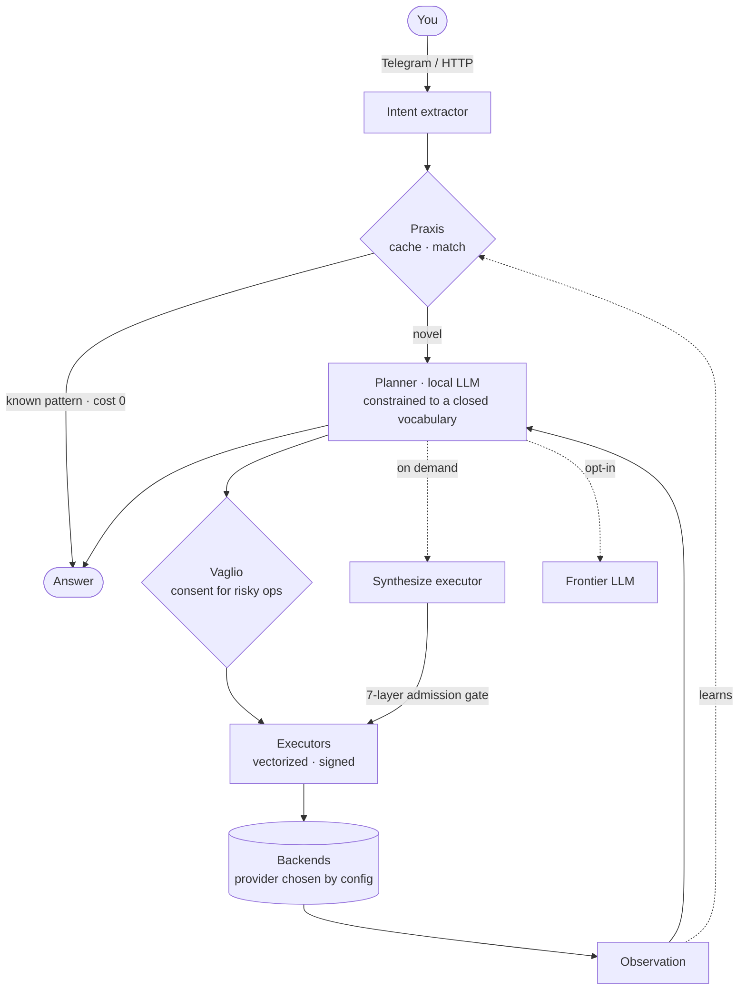

<div align="center">

# Metnos

**A self-hosted personal assistant that synthesizes its own tools.**

[](LICENSE)
-orange)


[](https://metnos.com)

*mētis* (cunning intelligence) + *noûs* (mind). Runs on your hardware. Talks to your files, mail, photos, calendar, and the web — only the ones you switch on.

### 📚 [**Read the architecture documentation → metnos.com**](https://metnos.com)
*Bilingual (IT/EN), diagram-rich, one page per subsystem — a first-class part of the project.*

</div>

---

> [!IMPORTANT]
> **This is a showcase, not a polished product.** Metnos is a working, daily-driven
> system, but it was built for one person on one machine. It is shared so other
> homelab / AI-architecture enthusiasts can read it, run it, and build on it.
> Many capabilities exist but have barely been exercised outside the reference
> instance (non-Italian i18n in particular is essentially **untested**). If something
> breaks: open an issue, and bring a little patience. Thank you. 🙏

## What it is

Metnos is a local-first assistant with an unusual core idea: instead of shipping a
fixed catalog of tools, it **synthesizes executors on demand** from a closed,
audited vocabulary, then runs them through a ReAct planner backed by a **local LLM**.
No cloud round-trip is required for the assistant to think or act — frontier models
are an opt-in fallback, not the engine.

You talk to it over **two channels out of the box**: a **web UI** (HTTP on port
8770 — chat in the browser, plus admin dashboards) and **Telegram** (message your
own bot). Both are set up by the installer; use either, or both. The web UI asks
for an admin key on first connect — it's auto-created at
`~/.config/metnos/admin.key`, and the installer prints a one-shot link that claims
it for your browser.



A few principles it takes seriously:

- **Vectorized by construction** — every executor takes a *list* and returns a *list*. There is no `*_batch`; the batch version *is* the executor.
- **Closed, composable vocabulary** — tools are named `verb_object[_qualifier]` from a fixed set of verbs and objects. New words require deliberate governance, not a free-for-all.
- **No silent failure** — counts reflect what was *actually* done; truncation is announced, never hidden; every action is undoable when it claims to be.
- **Deterministic over LLM** when a regex or a table is equipotent. The model is used where a language parser would be genuinely too complex, not as glue.

## How it differs from other self-hosted agents

Compared to drop-in agent frameworks (e.g. OpenClaw, Hermes and the broader
"skills" ecosystem), Metnos makes a different trade:

| | Typical agent framework | Metnos |
|---|---|---|
| **Tools** | Hand-written or imported packages, executed as-is | Synthesized at runtime from a closed vocabulary, **signed**, aged, smoke-tested |
| **Adding a capability** | Drop in code → it runs with the assistant's privileges | Code must pass a 7-layer admission gate before it can ever run |
| **Safety model** | Trust the author of the package | *Don't* trust the package — the package must pass the checks |
| **LLM** | Often cloud-first | Local-first; frontier is opt-in fallback |
| **Output** | Free-form per tool | Uniform list-in / list-out, pipeable between steps |
| **Language** | English-only; strings hard-coded | i18n by construction — every user-facing string and prompt is *per-language data*, so a new language is a **drop-in** translation pack, no code change. IT + EN validated today; more by drop-in (not yet tested) |
| **Setup** | Manual wiring | **Self-configuring** — the installer profiles your hardware to pick a fitting model/backend; each skill stays dormant until its service or credential appears, then activates on its own |

### Why Metnos did **not** adopt the standard skill format

The popular "skill" formats are convenient and dangerous in equal measure: you import
a package and the assistant *executes its code with its own privileges*. For a
self-hosted assistant that can touch your files, your mail, and your shell, that is
**remote code execution by design**. One malicious or sloppy package is enough.

Metnos chooses **security by construction** instead:

- a **closed, audited vocabulary** (you cannot name a tool that does something the grammar doesn't allow);
- a **7-layer admission gate** for any new or imported executor — signature → affinity overlap → aging → sandbox → smoke test → LLM verifier → append-only audit;
- **explicit consent** (a "vaglio" judgment) before anything destructive or capability-changing runs;
- per-skill **sandbox profiles** and provenance tracking.

The slogan is: *don't trust the package — the package has to earn its place.*

> **Roadmap — robust external import.** The goal is not to ignore the public skill
> ecosystem (agentskills.io and friends) but to **map** it into this verified,
> sandboxed model rather than executing it raw. The 5-stage importer is the
> foundation; hardening it is on the list.

## Skills: modular capabilities you turn on and off

Everything that ties Metnos to an external service, credential, or model is a
**skill** — a group of capabilities that is *dormant until configured* and that you
can enable or disable at will. The **core** (local files, processes, time, the
scheduler, and the in-memory helpers) is always on and needs nothing external.

First-party skills: `system` · `photos` · `mail` · `web` · `geo` · `calendar` · `github` · `google-workspace` · `frontier`.

`system` is the one that makes Metnos a real *host* assistant, not just a chatbot:
it can run shell commands, `sudo`, install packages and mount network shares — but
**every privileged action requires explicit consent** (a *vaglio* judgment), and the
skill can be **switched off entirely** to lock Metnos out of the system.

`google-workspace` is a first-party skill in its own right: one OAuth setup unlocks
Gmail, Calendar, Drive, Docs and Sheets, exposed through the same canonical
executors (so the planner never sees "Google" — it's a backend, chosen by config).

Manage them from the CLI **or** just by asking in chat:

```bash
python3 runtime/cli/skills_cli.py list          # see status + prerequisites
python3 runtime/cli/skills_cli.py disable github
```
> *"which skills do I have?"* · *"enable photos"* · *"disable the web"*

Enabling a skill you haven't configured is harmless: it stays visible but inert
until its prerequisite (an IMAP account, a SearXNG instance, a GitHub token, …) is
present.

### Skills vs backends — two orthogonal layers

This is where Metnos diverges most from drop-in frameworks, and it is a deliberate
consequence of running a **local** planner instead of a frontier model.

- A **backend** answers *how* an action runs against a concrete service
  (`backends/events/google_workspace.py`, `backends/events/local_ics.py`). The
  provider is chosen **from configuration**, deterministically, and is never
  exposed to the LLM — picking a provider is configuration, not intent.
- A **skill** answers *whether/which* capabilities are unlocked, trusted, and
  shipped. It governs activation (enable/disable), dormancy, sandboxing, and
  packaging.

They are **orthogonal**. They only coincide for a single-provider skill; they
diverge when one capability has several backends (calendar = local ICS / Google /
CalDAV) or none (photos = local models). The external dependency is declared
**once, at the backend**; the skill merely aggregates it.

Skills come in three tiers: **core** (always on, no external dependency),
**first-party** (shipped with Metnos, same audited standard, dormant until
configured), and **imported** (third-party, sandboxed behind the 7-layer gate).
Only core + first-party ship in this repo; imported skills are something *you*
install, and the "don't trust the package" thesis above is exactly about them.

**Adding a second provider (e.g. GitLab next to GitHub).** Drop-in frameworks add
a *parallel* skill per provider and let a frontier model disambiguate by reading
descriptions. A local planner can't do that reliably — it develops a provider
bias. So Metnos keeps **one provider-agnostic executor** (`find_issues`) and adds
a **backend** per provider; the resolver routes by configuration. Adding a
provider is *+1 backend file + 1 skill, zero new executors* — and the planner
never sees the choice. Promoting an already provider-baked tool into this shape is
an extraordinary, human-gated refactor (a one-time frontier pass generates it; you
review and sign it). See the architecture docs for the full design.

## Requirements (the honest version)

The code is the easy part. The real barrier is **hardware**: Metnos wants a machine
that can run a capable LLM locally. The reference instance uses a 96 GB
unified-memory box running a ~26B model via `llama-server`.

There are two install paths, and they are **not** equal:

1. **Managed (from scratch) — recommended.** Let the installer set up the whole
   stack in a known-good configuration: LLM serving, models, the supporting
   services (web search, geocoding, image VLM), and the wiring between them.
   Deterministic, reproducible, supportable.
2. **Custom (declare your existing LLM/services) — strongly discouraged.** If you
   already run an LLM, you *can* declare its endpoint, model and tier mapping for
   wiring. The installer will let you — and warn you loudly: this multiplies the
   variables (wrong model family, mis-mapped tiers, version drift) and is **hard
   to support**. Only pick this if you know your setup matches Metnos's
   requirements.

Everything else (web search, geocoding, mail, photos) is a skill you opt into; the
managed install wires it for you, the custom path leaves it to you.

## Install

```bash
git clone https://github.com/brunialti/metnos.git && cd metnos
bash install/bootstrap.sh --check   # pre-flight only — writes nothing
bash install/bootstrap.sh           # interactive, six-phase setup
```

The installer (English-only) is idempotent and safe to re-run. It walks you
through system checks, AI-backend setup, encrypted credentials, optional systemd
units, and **skill selection** — and it never pretends a missing prerequisite is
fine: it tells you what stays *dormant* and why. Full details, options, and the
phase breakdown are in [`install/README.md`](install/README.md). Then:

```bash
python3 runtime/metnos_http_server.py --host 0.0.0.0 --port 8770
curl http://127.0.0.1:8770/agent/health
```

Systemd unit templates live in [`install/units/`](install/units/).

## Metnos in the service of Metnos

The intended support model is itself part of the showcase, and frankly experimental:
**a Metnos instance helping people with Metnos** — triaging issues, answering
"how do I…", and pointing at the right docs. It's an honest dogfooding bet: if the
assistant can't help you run the assistant, that's a bug worth seeing. Expect rough
edges; that's the point.

## Documentation

Metnos ships with **extensive, first-class architecture documentation** — not a
stub README, but a full reference site built and maintained alongside the code:

- **[metnos.com](https://metnos.com)** — one richly illustrated page per subsystem:
  the ReAct planner, the multi-stage synthesis pipeline, executors & the closed
  vocabulary, the sandbox and *vaglio* safety layers, **skills ↔ backends**, the
  Telos alignment engine, fast paths, observability, and more.
- **Bilingual** (Italian + English), kept symmetric.
- **Diagram-heavy** — inline SVG flowcharts for every non-trivial mechanism.

It represents a large, ongoing effort and is the best way to understand *why*
Metnos is built the way it is — every non-obvious design choice is explained
there with its rationale.

👉 **Start at [metnos.com](https://metnos.com).**

## Status & contributing

Metnos is **pre-1.0**: APIs, signatures, and defaults change without backward-compat
shims when a better design appears. That's deliberate for now. Issues, questions,
and patches are all welcome — and so is patience.

## License

[AGPL-3.0](LICENSE). If you run a modified version as a network service, the AGPL's
network-use clause applies.
