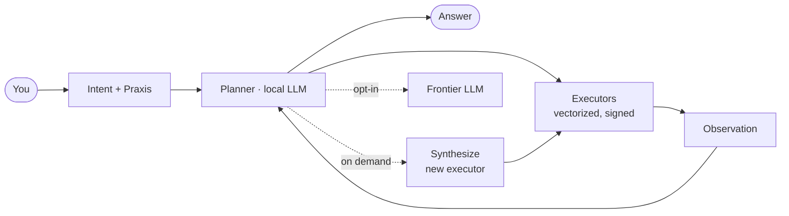

<div align="center">

# Metnos

**A self-hosted personal assistant that synthesizes its own tools.**

[](LICENSE)
-orange)


*mētis* (cunning intelligence) + *noûs* (mind). Runs on your hardware. Talks to your files, mail, photos, calendar, and the web — only the ones you switch on.

</div>

---

> [!IMPORTANT]
> **This is a showcase, not a polished product.** Metnos is a working, daily-driven
> system, but it was built for one person on one machine. It is shared so other
> homelab / AI-architecture enthusiasts can read it, run it, and build on it.
> Many capabilities exist but have barely been exercised outside the reference
> instance (non-Italian i18n in particular is essentially **untested**). If something
> breaks: open an issue, and bring a little patience. Thank you. 🙏

## What it is

Metnos is a local-first assistant with an unusual core idea: instead of shipping a
fixed catalog of tools, it **synthesizes executors on demand** from a closed,
audited vocabulary, then runs them through a ReAct planner backed by a **local LLM**.
No cloud round-trip is required for the assistant to think or act — frontier models
are an opt-in fallback, not the engine.


```mermaid
flowchart LR
    U([You]) --> R[Intent + Praxis]
    R --> P[Planner · local LLM]
    P --> E[Executors<br/>vectorized, signed]
    E --> O[Observation]
    O --> P
    P --> A([Answer])
    P -. on demand .-> S[Synthesize<br/>new executor]
    S --> E
    P -. opt-in .-> F[Frontier LLM]
```

A few principles it takes seriously:

- **Vectorized by construction** — every executor takes a *list* and returns a *list*. There is no `*_batch`; the batch version *is* the executor.
- **Closed, composable vocabulary** — tools are named `verb_object[_qualifier]` from a fixed set of verbs and objects. New words require deliberate governance, not a free-for-all.
- **No silent failure** — counts reflect what was *actually* done; truncation is announced, never hidden; every action is undoable when it claims to be.
- **Deterministic over LLM** when a regex or a table is equipotent. The model is used where a language parser would be genuinely too complex, not as glue.

## How it differs from other self-hosted agents

Compared to drop-in agent frameworks (e.g. OpenClaw, Hermes and the broader
"skills" ecosystem), Metnos makes a different trade:

| | Typical agent framework | Metnos |
|---|---|---|
| **Tools** | Hand-written or imported packages, executed as-is | Synthesized at runtime from a closed vocabulary, **signed**, aged, smoke-tested |
| **Adding a capability** | Drop in code → it runs with the assistant's privileges | Code must pass a 7-layer admission gate before it can ever run |
| **Safety model** | Trust the author of the package | *Don't* trust the package — the package must pass the checks |
| **LLM** | Often cloud-first | Local-first; frontier is opt-in fallback |
| **Output** | Free-form per tool | Uniform list-in / list-out, pipeable between steps |

### Why Metnos did **not** adopt the standard skill format

The popular "skill" formats are convenient and dangerous in equal measure: you import
a package and the assistant *executes its code with its own privileges*. For a
self-hosted assistant that can touch your files, your mail, and your shell, that is
**remote code execution by design**. One malicious or sloppy package is enough.

Metnos chooses **security by construction** instead:

- a **closed, audited vocabulary** (you cannot name a tool that does something the grammar doesn't allow);
- a **7-layer admission gate** for any new or imported executor — signature → affinity overlap → aging → sandbox → smoke test → LLM verifier → append-only audit;
- **explicit consent** (a "vaglio" judgment) before anything destructive or capability-changing runs;
- per-skill **sandbox profiles** and provenance tracking.

The slogan is: *don't trust the package — the package has to earn its place.*

> **Roadmap — robust external import.** The goal is not to ignore the public skill
> ecosystem (agentskills.io and friends) but to **map** it into this verified,
> sandboxed model rather than executing it raw. The 5-stage importer is the
> foundation; hardening it is on the list.

## Skills: modular capabilities you turn on and off

Everything that ties Metnos to an external service, credential, or model is a
**skill** — a group of capabilities that is *dormant until configured* and that you
can enable or disable at will. The **core** (local files, processes, time, the
scheduler, and the in-memory helpers) is always on and needs nothing external.

First-party skills: `photos` · `mail` · `web` · `geo` · `calendar` · `github` · `frontier`.

Manage them from the CLI **or** just by asking in chat:

```bash
python3 runtime/cli/skills_cli.py list          # see status + prerequisites
python3 runtime/cli/skills_cli.py disable github
```
> *"which skills do I have?"* · *"enable photos"* · *"disable the web"*

Enabling a skill you haven't configured is harmless: it stays visible but inert
until its prerequisite (an IMAP account, a SearXNG instance, a GitHub token, …) is
present.

## Requirements (the honest version)

The code is the easy part. The real barrier is **hardware**: Metnos wants a machine
that can run a capable LLM locally. The reference instance uses a 96 GB
unified-memory box running a ~26B model via `llama-server`. You have two options:

1. **Bring your own LLM** — point Metnos at any OpenAI-compatible `llama-server`
   endpoint (local or on another box) plus local ONNX embeddings.
2. **Run it all locally** — if your machine is big enough.

Everything else (web search, geocoding, mail, photos) is a skill you opt into and
supply a backend for.

## Install

```bash
git clone <this-repo> metnos && cd metnos
./install.sh --check      # congruence checks only — writes nothing
./install.sh              # interactive, multi-stage setup
```

The installer (English-only) walks you through system checks, AI-backend selection,
skill selection, and writes a minimal config (data dirs, a 0600 admin key,
`runtime.toml`). It never pretends a missing prerequisite is fine — it tells you
what stays dormant and why. Then:

```bash
python3 runtime/metnos_http_server.py --host 0.0.0.0 --port 8770
curl http://127.0.0.1:8770/agent/health
```

A sample `systemd` unit lives in [`install/metnos-http.service.example`](install/metnos-http.service.example).

## Metnos in the service of Metnos

The intended support model is itself part of the showcase, and frankly experimental:
**a Metnos instance helping people with Metnos** — triaging issues, answering
"how do I…", and pointing at the right docs. It's an honest dogfooding bet: if the
assistant can't help you run the assistant, that's a bug worth seeing. Expect rough
edges; that's the point.

## Documentation

Architecture docs (bilingual IT/EN, diagram-heavy) live in [`docs/`](docs/) and at
**metnos.com**. The design rationale for every non-obvious choice is recorded as an
ADR under [`decisions/`](decisions/).

## Status & contributing

Metnos is **pre-1.0**: APIs, signatures, and defaults change without backward-compat
shims when a better design appears. That's deliberate for now. Issues, questions,
and patches are all welcome — and so is patience.

## License

[AGPL-3.0](LICENSE). If you run a modified version as a network service, the AGPL's
network-use clause applies.
